<div align="center">

# Aaron

### Full-Stack Developer & Security Researcher

Webentwicklung · Cybersecurity · OSINT · Linux · Cloud-Infrastruktur · AI

[](https://joschaschmidt.com)
[](https://github.com/linuxaaron)


</div>

---

## Über mich

Ich beschäftige mich seit Jahren mit IT und arbeite besonders gerne an technischen Problemen, bei denen Recherche, Analyse und praktische Umsetzung zusammenkommen.

Mein Schwerpunkt liegt auf **Full-Stack-Webentwicklung, Cybersecurity und OSINT**. Dazu kommen Linux, Netzwerktechnik, Cloud-Infrastruktur und die technische Analyse komplexer Systeme.

Meine größte Stärke ist Recherche. Ich kann mich schnell in komplexe Themen einarbeiten, Informationen aus unterschiedlichen Quellen miteinander verbinden und daraus nachvollziehbare und praktikable Lösungen entwickeln.

## Aktueller Fokus

- Full-Stack-Webentwicklung mit modernen Webtechnologien
- Cybersecurity und Web Security
- OSINT und technische Recherche
- Linux / Unix, Windows und macOS
- BSD-Betriebssysteme
- Netzwerktechnik und Systemadministration
- Cloud Computing mit Vercel, Cloudflare, Oracle Cloud und Microsoft Azure
- Containerisierung mit Docker
- Git und GitHub
- Automatisierung und technische Analyse
- KI-gestützte Entwicklung mit OpenAI und Claude
- eigene Security- und Analyseprojekte

---

## ⚡ Skills & Technologies

### 💻 Programming Languages

<table>
<tr>
<td align="center" width="100"><br><sub><b>Python</b></sub></td>
<td align="center" width="100"><br><sub><b>Go</b></sub></td>
<td align="center" width="100"><br><sub><b>JavaScript</b></sub></td>
<td align="center" width="100"><br><sub><b>TypeScript</b></sub></td>
<td align="center" width="100"><br><sub><b>C</b></sub></td>
<td align="center" width="100"><br><sub><b>C++</b></sub></td>
<td align="center" width="100"><br><sub><b>Java</b></sub></td>
<td align="center" width="100"><br><sub><b>Bash</b></sub></td>
<td align="center" width="100"><br><sub><b>SQL</b></sub></td>
</tr>
</table>

### 🌐 Web Development

<table>
<tr>
<td align="center" width="100"><br><sub><b>HTML5</b></sub></td>
<td align="center" width="100"><br><sub><b>CSS3</b></sub></td>
<td align="center" width="100"><br><sub><b>JavaScript</b></sub></td>
<td align="center" width="100"><br><sub><b>TypeScript</b></sub></td>
<td align="center" width="100"><br><sub><b>React</b></sub></td>
<td align="center" width="100"><br><sub><b>Next.js</b></sub></td>
<td align="center" width="100"><br><sub><b>Node.js</b></sub></td>
<td align="center" width="100"><br><sub><b>Express</b></sub></td>
<td align="center" width="100"><br><sub><b>Tailwind CSS</b></sub></td>
</tr>
</table>

### 🛠️ Tools & Frameworks

<table>
<tr>
<td align="center" width="100"><br><sub><b>Git</b></sub></td>
<td align="center" width="100"><br><sub><b>GitHub</b></sub></td>
<td align="center" width="100"><br><sub><b>Docker</b></sub></td>
<td align="center" width="100"><br><sub><b>Kubernetes</b></sub></td>
<td align="center" width="100"><br><sub><b>VS Code</b></sub></td>
<td align="center" width="100"><br><sub><b>Vim</b></sub></td>
<td align="center" width="100"><br><sub><b>Postman</b></sub></td>
<td align="center" width="100"><br><sub><b>MongoDB</b></sub></td>
<td align="center" width="100"><br><sub><b>Flutter</b></sub></td>
</tr>
</table>

### 🛡️ Cybersecurity

<table>
<tr>
<td align="center" width="120"><br><sub><b>Burp Suite</b></sub></td>
<td align="center" width="120"><br><sub><b>Metasploit</b></sub></td>
<td align="center" width="120"><br><sub><b>Wireshark</b></sub></td>
<td align="center" width="120"><br><sub><b>Linux Security</b></sub></td>
</tr>
</table>

### 🖥️ Operating Systems

<table>
<tr>
<td align="center" width="100"><br><sub><b>Linux</b></sub></td>
<td align="center" width="100"><br><sub><b>Ubuntu</b></sub></td>
<td align="center" width="100"><br><sub><b>Debian</b></sub></td>
<td align="center" width="110"><br><sub><b>Parrot OS</b></sub></td>
<td align="center" width="110"><br><sub><b>Kali Linux</b></sub></td>
<td align="center" width="110"><br><sub><b>GhostBSD</b></sub></td>
<td align="center" width="110"><br><sub><b>BlackArch</b></sub></td>
<td align="center" width="100"><br><sub><b>macOS</b></sub></td>
</tr>
</table>

### 🤖 AI & Automation

<table>
<tr>
<td align="center" width="110"><br><sub><b>OpenAI</b></sub></td>
<td align="center" width="110"><br><sub><b>Claude</b></sub></td>
<td align="center" width="110"><br><sub><b>Selenium</b></sub></td>
<td align="center" width="110"><br><sub><b>Terraform</b></sub></td>
</tr>
</table>

> **Tip:** Die Icons sind bewusst als einzelne Elemente mit Beschriftung aufgebaut. Dadurch bleibt die Darstellung auch auf kleineren Bildschirmen übersichtlich.

## GitHub Stats 🤖

<div align="center">




</div>

## Security & OSINT

Ich beschäftige mich mit passiver Informationsgewinnung, technischer Recherche, Webanalyse und Security Testing innerhalb eines definierten und autorisierten Rahmens.

### OSINT & Recherche

```text
OSINT
Technische Webrecherche
Quellenanalyse
WHOIS / DNS-Recherche
Domain- und Infrastruktur-Recherche
Metadatenanalyse
Social-Media-Recherche
Informationskorrelation
Network Reconnaissance
```

### Security Tools & Workflows

```text
Burp Suite
Browser Developer Tools
Nmap
Wireshark
OWASP-orientierte Webanalyse
Linux Security Tools
Netzwerkdiagnose
Log- und Systemanalyse
```

## Ausgewählte Projekte

### web-osint

Werkzeug für passive technische Webanalyse und OSINT-Workflows.

[Repository](https://github.com/linuxaaron/web-osint)

### malware-analyzer

Werkzeug zur strukturierten statischen Analyse verdächtiger Dateien und Malware-Indikatoren.

[Repository](https://github.com/linuxaaron/malware-analyzer)

### security-dashboard

Webanwendung zur Übersicht über Assets, Schwachstellen, Sicherheitsereignisse und einen nachvollziehbaren Security Score.

[Repository](https://github.com/linuxaaron/security-dashboard)

### Osint-ADHD

Kuratierte Sammlung von OSINT-Ressourcen mit automatischer Synchronisation des offiziellen OSINT Frameworks.

[Repository](https://github.com/linuxaaron/Osint-ADHD)

### tiktok-mobile-emulator

Inoffizielle Browser-Erweiterung für eine iPhone-artige Desktop-Darstellung von TikTok.

[Repository](https://github.com/linuxaaron/tiktok-mobile-emulator)

## Praktische Erfahrung

Ich arbeite nicht nur theoretisch mit Technologien, sondern setze sie in eigenen Projekten praktisch ein.

Dazu gehören Full-Stack-Webentwicklung, Deployment, DNS- und Edge-Konfiguration, Cloud-Infrastruktur, Container mit Docker, Versionskontrolle mit Git und GitHub sowie Arbeiten mit Vercel, Cloudflare, Oracle Cloud und Azure.

Außerdem beschäftige ich mich mit Linux- und Unix-Systemen, Windows, macOS und BSD, Netzwerken, Serverkonfiguration, Browser-Einrichtung, Automatisierung und technischer Recherche.

Auch mit Kryptowährungen und Mining habe ich praktische Erfahrung. Ich habe Mininganlagen selbst aufgebaut, konfiguriert und in Betrieb genommen und dabei Hardware und technische Infrastruktur eingerichtet.

## Arbeitsweise

```text
Recherche
   ↓
Analyse
   ↓
Zusammenhänge erkennen
   ↓
Lösung entwickeln
   ↓
Umsetzen
   ↓
Testen
```

Mir ist wichtig, dass eine Lösung nicht nur funktioniert, sondern technisch nachvollziehbar, wartbar und sauber umgesetzt ist.

## Kontakt & Links

**Website:** https://joschaschmidt.com  
**GitHub:** https://github.com/linuxaaron

---

## Verantwortungsvolle Nutzung und rechtliche Hinweise

Die auf diesem Profil veröffentlichten Tools, Beispiele und technischen Inhalte dienen ausschließlich zu Lern-, Forschungs-, Entwicklungs- und Testzwecken sowie zur defensiven Security-Forschung.

Sicherheitsprüfungen, Penetrationstests, OSINT-Analysen oder sonstige Zugriffe auf fremde Systeme, Domains, Accounts oder Daten dürfen ausschließlich mit ausdrücklicher Genehmigung des jeweiligen Eigentümers und innerhalb eines klar definierten Scopes durchgeführt werden. Eine unbefugte Nutzung ist nicht gestattet.

Die MIT-Lizenz gewährt Rechte am jeweiligen Quellcode. Sie gewährt **keine** Erlaubnis zum Zugriff auf fremde Systeme, Accounts oder Daten und setzt keine gesetzlichen Vorschriften, Verträge oder Nutzungsbedingungen Dritter außer Kraft.

Drittanbieter-Software, APIs, Marken, Datensätze und sonstige Inhalte unterliegen ihren jeweiligen Lizenzen und Nutzungsbedingungen. Vor Weitergabe oder kommerzieller Nutzung sind diese Bedingungen eigenständig zu prüfen.

Du bist selbst für die Nutzung der veröffentlichten Software und deren Folgen verantwortlich.

<div align="center">

<sub>Gebaut mit Neugier, Recherche und praktischer Softwareentwicklung.</sub>

</div>
